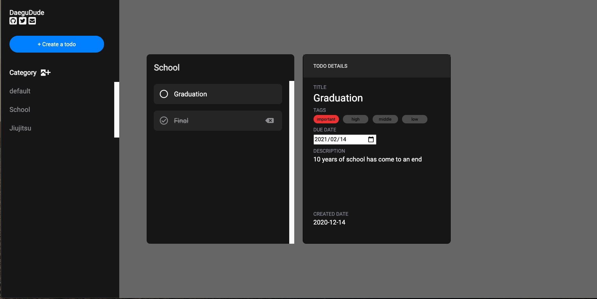

# TodoList

TodoList project that is a part of open source web development curriculum The Odin Project. 

## DESCRIPTION

You can make a todo of your own and keep up with todos that you need to complete.
Here is the [live demo](https://daegudude.github.io/todoList/) for trial.



## STACKS USED

- HTML / CSS
- Javascript
- Webpack
- Npm
- localStorage

## VERSION

- Version1

## Things to improve

- **Logical Thinking**: When problem occurs, I tend to just make my way through it, not without thinking about how to solve problems step by step.

- **How to write DRY code**: Looking at my code, there's a lot of codes that are repeated. For example,

```javascript
// 'From Category Selection Modal'
const closeModal = () => {
  const modal = get.modal();
  modal.remove();
}

// 'From Create Todo Modal'
const closeModal = () => {
  const modal = get.modal();
  modal.remove();
}

// 'From Create List Modal'
const closeModal = () => {
  const modal = get.modal();
  modal.remove();
}
```

All these things have same function declared on its own. But it's doing exactly same thing.

- **How to separate the code(module)**: I break down the todoList project into separate components so it's more manageable. And here are the list of my components. 

Display:

`categorySelectionModal`, `createListModal`, `createTodoModal`, `navBar`, `todoDetailsCardView`, `todoListCardView`, 

Application Logic:

`Todo`, `TodoList`. 

What I am understanding at this point is, break it into the components and put functions that belong to it. 
For example, I have `todoListCardView` component, which will list all todolist on the display. And it has a lot of functions inside, it's just not visible. 

How do I organise these functions that make `todoListCardView` component? 
If my component has a lot of features, more functions it will have. And I have a hard time how to separate these.

## Future Plan(Refactoring)

Aim: Write the code that's easier to understand.


